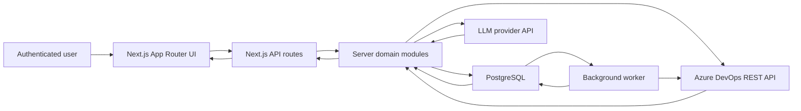

# Project Architecture

This document is the living architecture map for iTestFlow. Update it whenever a change adds, removes, or meaningfully reshapes a route, workflow, module boundary, integration, persistent data model, worker behavior, or major UI surface.

## Architecture Overview

iTestFlow is a privately hosted, workspace-scoped Next.js application for Azure DevOps testing workflows. The browser talks only to Next.js pages and API routes. Server-side modules own authentication, workspace authorization, project isolation, PostgreSQL access, Azure DevOps integration, LLM provider calls, RAG/knowledge workflows, audit logging, and background jobs.

Primary dependency direction:

- UI routes and components call local API routes.
- API routes validate input, resolve authenticated workspace/project context, and delegate to modules.
- Domain modules own workflow logic, SQL access, Azure DevOps adapter calls, LLM calls, and audit/activity records.
- Integration adapters isolate external API details from workflow services.
- PostgreSQL stores all durable application data, including users, sessions, workspaces, credentials metadata, encrypted secrets, project anchors, indexed context, compiled knowledge, jobs, audit logs, and workflow analytics.
- The worker process claims jobs from PostgreSQL and performs scheduled/on-demand workspace sync outside the web request path.

## Product Shape

iTestFlow helps QA, product, and delivery teams:

- Sign in with an Azure DevOps organization and Personal Access Token.
- Work inside an enabled workspace tied to one Azure DevOps organization.
- Select an active Azure DevOps project whose server-side project anchor is validated before scoped reads or writes.
- Store each user's Azure DevOps PAT and LLM API key encrypted and private to that user/workspace.
- Index filtered Azure DevOps work items into project context.
- Compile durable project knowledge with revisions, health checks, citations, and Markdown export.
- Ask grounded questions through the Business Owner Assistant.
- Analyze requirements, design test cases, review gaps, estimate execution effort, report bugs, migrate suites, and bulk-create tasks.
- Publish only reviewed artifacts back to Azure DevOps.
- Review dashboards, activity history, audit logs, jobs, and workspace-level settings.

The app intentionally avoids becoming a general Azure DevOps work-item browser. Work items are loaded for concrete workflows or through filtered Knowledge Hub/context sync.

## Runtime Stack

- Framework: Next.js App Router, React, and TypeScript.
- UI: Tailwind CSS, shadcn/Radix primitives, lucide-react icons, Sonner toasts, and Recharts.
- Database: PostgreSQL via `pg`, with migrations in `migrations/` managed by `node-pg-migrate`.
- Background work: `npm run worker`, using the `jobs` table with `FOR UPDATE SKIP LOCKED`, heartbeats, and stale-lock recovery.
- Authentication: opaque session cookie backed by hashed session tokens in PostgreSQL.
- External systems: Azure DevOps REST APIs and OpenAI, Gemini, or Anthropic LLM provider APIs.

## Source Layout

`src/app`
: Next.js page routes and API endpoints. Page routes own screen-level composition. API routes should remain thin adapters around module services.

`src/components`
: Current UI system. `layout` owns the app shell, topbar, sidebar, and content wrappers. `dashboard`, `domain`, and `qa` own workflow-oriented UI. `ui` contains shadcn/Radix-style base components.

`src/modules`
: Server-side application, domain, security, integration, analytics, RAG, auth, workspace, credential, job, and workflow services. Keep business logic here instead of in route handlers or React components.

`src/shared`
: Shared browser helpers and legacy shared components still used by parts of the app. Prefer `src/components` and `src/lib` for new active UI work unless refactoring an existing shared component.

`src/types`
: Client-facing shared TypeScript shapes.

`src/lib`
: Small frontend constants and utilities.

`migrations`
: PostgreSQL schema migrations. The app startup instrumentation applies pending migrations idempotently, but production deployments should still run migrations as an explicit release step.

`docs`
: Durable deployment and design reference docs. Historical implementation plans can be archived or deleted once their decisions have been folded into this architecture document and deployment guide.

## App Shell And Navigation

The active shell is `src/components/layout/app-shell.tsx`. It wraps the authenticated app and renders:

- `src/components/layout/sidebar.tsx` for primary workflow navigation.
- `src/components/layout/topbar.tsx` for active project selection and Azure DevOps profile state.

The root route redirects to `/dashboards`. `/setup` and `/configuration` redirect to `/settings`. `/login` is public; authenticated page navigations are protected by `src/middleware.ts`. API routes validate sessions server-side and return JSON errors instead of redirects.

Durable page routes:

- `/dashboards`
- `/knowledge-hub`
- `/business-owner-assistant`
- `/requirements-analysis`
- `/test-case-design`
- `/test-gap-analysis`
- `/test-execution-effort`
- `/report-bug`
- `/suite-migration`
- `/bulk-task-creation`
- `/settings`
- `/activity-log`
- `/test-cases/new`

## Auth, Workspace, And Project Scope

Authentication is PAT-backed:

- `POST /api/auth/login` validates the submitted PAT against the selected Azure DevOps organization.
- Enabled organizations map to rows in `workspaces`.
- Successful login provisions or updates the user, ensures workspace membership, stores the user's PAT encrypted, and creates an opaque session cookie.
- Session tokens are hashed in PostgreSQL; the raw token exists only in the browser cookie.

Workspace resolution is centralized in `src/modules/credentials/scoped-resolution.service.ts` and `src/modules/workspace`.

Project isolation is mandatory:

- The browser can submit a candidate `ProjectScope`, but route handlers must resolve a trusted scope for the authenticated workspace.
- `src/modules/projects/workspace-projects.service.ts` owns project anchors and trusted project resolution.
- Project-scoped Azure DevOps adapters must be created with the trusted scope so by-ID work item reads/writes are checked against the item's real `System.TeamProject`.
- Feature rows include workspace/project ownership columns and must never rely on client-supplied Azure project fields for authorization decisions.

## Core Workflows

Settings and workspace administration:

- `/settings` manages private user credentials and workspace-wide options.
- `/api/settings/credentials` stores encrypted Azure DevOps and LLM credentials for the current user/workspace.
- `/api/settings/llm-models` lists provider models where supported.
- `/api/workspace/*` manages members, workspace settings, sync credentials, sync schedules, sync requests, and job status.

Authentication:

- `/login` signs users into enabled Azure DevOps organizations.
- `/api/auth/login` validates PATs, stores encrypted credentials, and creates sessions.
- `/api/auth/session` reports the current authentication state.

Project selection:

- `/api/azure-devops/projects` lists projects through a user org-level Azure DevOps adapter.
- `/api/azure-devops/project/select` verifies selection and persists a workspace project anchor.
- The topbar uses the selected anchor as the active project scope for project-scoped workflows.

Dashboards:

- `/dashboards` renders project-scoped QA leadership analytics.
- `/api/dashboard/analytics`, `/api/dashboard/my-workbench`, and `/api/dashboard/system-analytics` aggregate Azure DevOps test results, defects, coverage, blockers, readiness, workflow history, and user/workbench metrics.
- Dashboard services live under `src/modules/dashboard` and `src/modules/analytics`.

Knowledge Hub and RAG:

- `/knowledge-hub` indexes filtered Azure DevOps work items, compiles project knowledge, reports knowledge health, and exports a Markdown wiki.
- `/api/context/index`, `/api/context/status`, and `/api/context/suggestions` manage project context indexing and retrieval.
- `/api/context/knowledge/*` manages extraction, preview, save, lint, log, promotion, manual drafting/finalization/validation/consolidation, status, and export.
- RAG storage, compiled knowledge, retrieval, linting, and citations live under `src/modules/rag`.
- The compiled knowledge design is documented in `docs/knowledge-wiki-rag-enhancement.md`.

Business Owner Assistant:

- `/business-owner-assistant` asks project questions against retrieved context and compiled knowledge.
- `/api/context-chatbot/message` returns grounded answers with citations.

Requirements Analysis:

- `/requirements-analysis` analyzes a real Azure DevOps requirement.
- `/api/requirement-analysis/run`, `/comment`, and `/manual/*` fetch target data, resolve context, call or validate LLM output, and publish reviewed comments.
- Service, schema, comment, and prompt logic live under `src/modules/requirement-analysis`.

Test Case Design:

- `/test-case-design` and `/test-cases/new` generate editable test cases.
- `/api/test-cases/generate`, `/api/test-cases/manual/*`, and `/api/publish/test-cases` prepare, validate, and publish reviewed Azure Test Case work items.
- Service, schema, and generation logic live under `src/modules/test-case-design`.

Test Gap Analysis:

- `/test-gap-analysis` compares requirement details to linked Azure DevOps test cases and creates selected additions.
- `/api/existing-test-case-review/*` runs automatic/manual review.
- `/api/test-coverage-matrix/suggested-additions/publish` creates selected Azure Test Case additions and links them to the user story.
- Service, prompt, and schema code live under `src/modules/existing-test-case-review`.

Test Execution Effort:

- `/test-execution-effort` estimates realistic manual QA execution effort for linked test cases.
- `/api/test-execution-effort/prepare`, `/generate`, `/external-prompt`, and `/manual/submit` fetch scoped data, build prompts, call or validate LLM output, and return structured estimates.
- Service, prompt, schema, and data-loading code live under `src/modules/test-execution-effort`.

Bug Reporting:

- `/report-bug` converts QA notes into reviewed Azure DevOps Bug work items.
- `/api/bugs/generate`, `/metadata`, `/post`, `/manual/*`, and `/reproduction-test-case/publish` generate, validate, and publish bug reports and optional reproduction test cases.
- Service and schemas live under `src/modules/bug-reporting`.

Suite Migration:

- `/suite-migration` previews and runs same-project Azure Test Suite copy/move operations.
- `/api/test-suite-migration/tree`, `/preview`, and `/execute` load suite trees, build dry-run plans, and execute confirmed migrations.
- `src/modules/test-suite-migration` owns selection normalization, recursive hierarchy planning, outcome mapping, guarded move deletion, and migration reporting.

Bulk Task Creation:

- `/bulk-task-creation` creates multiple Azure DevOps Tasks under selected User Stories.
- `/api/azure-devops/bulk-tasks` owns the write path through the Azure DevOps bulk task service.

Activity and audit:

- `/activity-log` and `/api/activity-log` show workflow activity for the authenticated workspace/project scope.
- Audit rows are stored in PostgreSQL and surfaced through activity-log workflows.
- Audit and activity services live under `src/modules/audit` and `src/modules/activity-log`.

## Integration Boundaries

Azure DevOps:

- Adapter interface: `src/modules/integrations/azure-devops/azure-devops-adapter.ts`.
- REST implementation: `src/modules/integrations/azure-devops/azure-devops-client.ts`.
- Mapping: `src/modules/integrations/azure-devops/azure-devops-mapper.ts`.
- Workflow-specific services handle comments, linked test cases, test plan publishing, suite migration, bulk task creation, metadata, and user/project reads.
- Use org-level adapters only for org-wide reads such as profile, project list, and connection validation.
- Use project-scoped adapters for project data and writes.

LLM providers:

- Provider factory: `src/modules/llm/llm-provider.factory.ts`.
- Provider implementations: `src/modules/llm/providers`.
- Prompt registry and prompt renderers: `src/modules/llm/prompts`, `manual-prompt.ts`, and `markdown-prompt-renderer.ts`.
- JSON extraction, structured output handling, retry behavior, token caps, provider base URLs, and warnings live under `src/modules/llm`.
- Per-user provider credentials are resolved through `src/modules/credentials`.

Database:

- PostgreSQL helper functions live in `src/modules/shared/infrastructure/database/db.ts`.
- Use `sqlAll`, `sqlGet`, `sqlRun`, and `withTransaction` instead of opening ad hoc database clients.
- Use named parameters (`@name`) in SQL strings; the helper translates them to PostgreSQL positional placeholders.
- Fire-and-forget audit/analytics writes should use the background write queue when they must not fail the request path.

## Background Jobs

The worker entrypoint is `src/worker/main.ts`.

- Run production workers with `npm run worker`.
- Run local watched workers with `npm run worker:dev`.
- Job handlers are registered in `src/modules/jobs/register-handlers.ts`.
- The queue is implemented in `src/modules/jobs/job-queue.service.ts`.
- Scheduled workspace sync is implemented in `src/modules/jobs/sync-schedule.service.ts` and `workspace-sync.handler.ts`.
- Workers claim jobs with row locks, heartbeat active jobs, and mark stale locks retryable according to environment settings.

Multiple worker processes may run against the same database. A job should be written to tolerate retries because failed or stale jobs can be requeued.

## Current Architecture Decisions

- iTestFlow is a hosted workspace app, not a single-user local settings file app.
- PostgreSQL is the only durable data store.
- All browser-to-provider access flows through server-side API routes.
- User Azure DevOps and LLM credentials are private per user/workspace and encrypted before persistence.
- Shared project context, compiled knowledge, dashboards, jobs, audit logs, and workflow history are workspace scoped.
- Azure DevOps is an integration, not a standalone bulk work-item browser.
- Project Context/Knowledge Hub is the only place that intentionally fetches many work items, and it does so with filters.
- Workflows usually operate on one selected project and one target work item ID.
- All project-scoped Azure DevOps access must be resolved through trusted workspace/project scope before reading or writing.
- Server route handlers should stay thin and delegate validation, integration calls, and business rules to modules.
- UI components should not call Azure DevOps or LLM providers directly.
- New navigation items should represent user workflows, not technical resources.

## Maintenance Rules

Update this document when you:

- Add, remove, or rename a page route or API route.
- Add a new domain module under `src/modules`.
- Change how sessions, credentials, workspace settings, project scope, audit logs, jobs, or indexed context are stored.
- Add or remove an Azure DevOps or LLM integration capability.
- Change worker behavior, job types, lock/retry behavior, or scheduler behavior.
- Move active UI ownership between `src/components` and `src/shared`.
- Make an architecture decision that future development should follow.

Keep updates short and factual. Prefer changing the relevant section instead of appending a chronological changelog.
