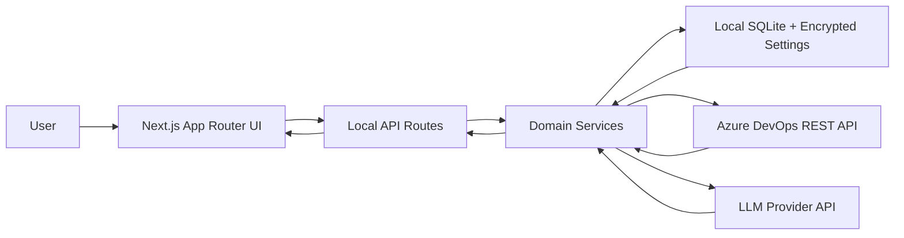

# Project Architecture

This document is the living architecture map for iTestFlow. Update it whenever a change adds, removes, or meaningfully reshapes a route, workflow, module boundary, integration, persistent data model, or major UI surface.

## Architecture Overview

iTestFlow is organized as a local Next.js application with thin API routes, server-side domain modules, local encrypted configuration, local SQLite storage, and outbound calls to Azure DevOps and the selected LLM provider. The browser never calls Azure DevOps or LLM APIs directly.

Primary dependency direction:

- UI routes and components call local API routes.
- API routes validate requests, resolve configuration, and delegate to modules.
- Domain modules own workflow logic, SQL access, Azure DevOps adapter calls, and LLM calls.
- Integration adapters isolate external API details from workflow services.
- Local storage supports runtime settings, audit logs, indexed context, and workflow records.

## Product Shape

iTestFlow is a local-first QA command center for Azure DevOps testing workflows. It helps a user:

- Configure Azure DevOps and LLM provider credentials locally.
- Select one Azure DevOps project as the active scope.
- Fetch and index filtered project context for RAG-assisted retrieval.
- Analyze one real Azure DevOps requirement at a time.
- Generate and edit test cases for a selected work item.
- Build a Test Coverage Matrix from existing linked Azure DevOps test cases.
- Estimate manual Test Execution Effort for linked Azure DevOps test cases on a selected story.
- Publish approved comments and test cases back to Azure DevOps.
- Audit local workflow activity.

The app intentionally avoids loading every Azure DevOps work item into a standalone page. Work items are fetched either by specific ID for a workflow or through filtered Project Context indexing.

## Runtime Stack

- Framework: Next.js App Router with React and TypeScript.
- Styling: Tailwind CSS with shadcn/Radix UI primitives and lucide-react icons.
- Local persistence: SQLite schema and helper access under `src/modules/shared/infrastructure/database`.
- Runtime configuration: encrypted local settings under `data/`, with optional `.env.local` bootstrap.
- External systems: Azure DevOps REST APIs and LLM providers.

## Source Layout

`src/app`
: Next.js routes and API endpoints. Page routes own screen-level composition. API routes adapt HTTP requests into module service calls.

`src/components`
: Current UI system. `layout` owns the active app shell, topbar, sidebar, and content wrappers. `domain` owns workflow-specific UI. `qa` owns reusable QA-focused display primitives. `ui` contains shadcn/Radix-style base components.

`src/modules`
: Server-side application, integration, and domain services. Keep business logic here instead of in route handlers or React components.

`src/shared`
: Older shared UI and browser helpers still used by parts of the app. Prefer `src/components` and `src/lib` for new active UI work unless refactoring an existing shared component.

`src/types`
: Client-facing shared TypeScript shapes.

`src/lib`
: Small frontend constants and utilities.

## App Shell And Navigation

The active shell is `src/components/layout/app-shell.tsx`. It wraps every route except setup pages and renders:

- `src/components/layout/sidebar.tsx` for primary navigation.
- `src/components/layout/topbar.tsx` for project selection and Azure DevOps profile state.

Navigation should point only to durable workflow surfaces. Avoid adding broad integration landing pages unless they are required for a real user task.

## Core Workflows

Setup and settings:

- `/setup` handles initial runtime configuration.
- `/settings` lets the user review and update saved runtime settings.
- API routes under `/api/settings/*` validate connections, save settings, and list provider models.

Project scoping:

- The header selector loads Azure DevOps projects through `/api/azure-devops/projects`.
- Active project scope is stored client-side by `src/shared/lib/active-project.ts`.
- Server actions validate scope through `src/modules/projects/project-isolation.guard.ts`.

Dashboard analytics:

- `/dashboard` renders local DevOps analytics from existing workflow, context, LLM, publish, and audit data.
- `/api/dashboard/analytics` returns project-scoped or all-project local SQLite aggregates for KPI cards, charts, and recent activity.
- Dashboard UI uses reusable components under `src/components/dashboard` and theme-aware Recharts visualizations.

Project Context:

- `/context` fetches and indexes filtered Azure DevOps work items.
- `/api/context/index` calls `indexAzureWorkItemsAsProjectContext`.
- `/api/context/status` reads locally indexed context status.
- `/api/context/suggestions` retrieves and ranks context for a target work item.
- Context sync defaults to incremental content-hash updates; full rebuild remains available for recovery.
- RAG storage, chunking, compiled knowledge, knowledge health, and Markdown wiki export live in `src/modules/rag`.
- The compiled knowledge design is documented in `docs/knowledge-wiki-rag-enhancement.md`.

Requirement Analysis:

- UI routes live under `/requirements/*`.
- `/api/requirement-analysis/run` fetches target work item data and selected context, then calls the requirement analysis service.
- `/api/requirement-analysis/comment` pushes reviewed comments back to Azure DevOps.
- Prompts, schemas, and service logic live under `src/modules/requirement-analysis`.

Test Case Design:

- UI routes live under `/test-cases/*`.
- `/api/test-cases/generate` generates test cases from one selected Azure DevOps work item and chosen context.
- `/api/publish/test-cases` publishes approved test cases to Azure Test Plans.
- Prompt, schema, and generation logic live under `src/modules/test-case-design`.

Test Coverage Matrix:

- UI routes live under `/test-coverage-matrix`, `/existing-test-case-review*`, and `/test-cases/existing-review`.
- `/api/existing-test-case-review/run` fetches linked test cases from Azure DevOps and runs the review service.
- `/api/test-coverage-matrix/suggested-additions/publish` creates suggested Azure Test Case work items and links them to the user story.
- Service, prompt, and schema code live under `src/modules/existing-test-case-review`.

Test Execution Effort:

- `/test-execution-effort` estimates realistic manual QA execution effort for linked Azure DevOps test cases on one selected story or requirement work item.
- `/api/test-execution-effort/prepare`, `/generate`, `/external-prompt`, and `/manual/submit` fetch project-scoped story/test case data, resolve project context, build prompts, call or validate LLM output, and return structured estimates.
- Service, prompt, schema, and data-loading code live under `src/modules/test-execution-effort`.

Test Suite Migration:

- `/test-suite-migration` lets a user preview and run same-project Azure Test Suite copy/move operations.
- `/api/test-suite-migration/tree`, `/preview`, and `/execute` load suite trees, build dry-run plans, and execute confirmed migrations.
- `src/modules/test-suite-migration` owns selection normalization, recursive hierarchy planning, test point outcome mapping, guarded move deletion, and migration reporting.

Audit:

- `/audit-logs` reads local audit activity through `/api/audit-logs`.

## Integration Boundaries

Azure DevOps:

- Adapter interface: `src/modules/integrations/azure-devops/azure-devops-adapter.ts`.
- REST implementation: `src/modules/integrations/azure-devops/azure-devops-client.ts`.
- Mapping: `src/modules/integrations/azure-devops/azure-devops-mapper.ts`.
- Workflow-specific services handle comments, linked test cases, test plan publishing, and test suite migration.
- Project isolation: Azure DevOps resolves work items by global ID and ignores the project segment in by-ID URLs, so the URL provides no isolation. Project-scoped work must construct the adapter with `getProjectScopedAzureDevOpsAdapter(scope)` (`configured-azure-devops.ts`), which binds the active project; the client then validates every by-ID read/write/batch and test-plan/suite operation against the work item's real `System.TeamProject` and rejects cross-project access as not-found-in-project. Use the unbound `getConfiguredAzureDevOpsAdapter()` only for org-level calls (project list, profile, connection test).

LLM providers:

- Provider factory: `src/modules/llm/llm-provider.factory.ts`.
- Configured provider resolution: `src/modules/llm/configured-provider.ts`.
- Provider implementations live under `src/modules/llm/providers`.
- Structured output repair lives in `src/modules/llm/output-repair.service.ts`.

Database:

- Schema lives in `src/modules/shared/infrastructure/database/schema.sql`.
- Database helper functions live in `src/modules/shared/infrastructure/database/db.ts`.
- Feature services should own their SQL access close to the behavior they support.

## Current Architecture Decisions

- Azure DevOps is an integration, not a standalone bulk work item browser.
- Workflows operate on a selected project and usually one target work item ID.
- All Azure DevOps work item access is strictly project-scoped. Because Azure ignores the project segment for by-ID operations, isolation is enforced in the adapter (bound via `getProjectScopedAzureDevOpsAdapter`) by validating each item's real `System.TeamProject`, not by the URL. Local SQLite reads/writes filter on `project_id` + `azure_project_id`.
- Project Context is the only place that intentionally fetches multiple work items, and it does so with filters.
- Server route handlers should stay thin and delegate validation, integration calls, and business rules to modules.
- UI components should not call Azure DevOps directly except through local API routes.
- New navigation items should represent user workflows, not technical resources.

## Maintenance Rules

Update this document when you:

- Add, remove, or rename a page route or API route.
- Add a new domain module under `src/modules`.
- Change where project scope, settings, audit logs, or indexed context are stored.
- Add or remove an Azure DevOps or LLM integration capability.
- Move active UI ownership between `src/components` and `src/shared`.
- Make an architecture decision that future development should follow.

Keep updates short and factual. Prefer changing the relevant section instead of appending a chronological changelog.
