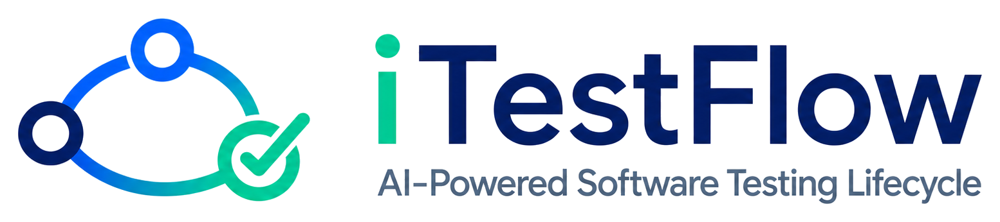
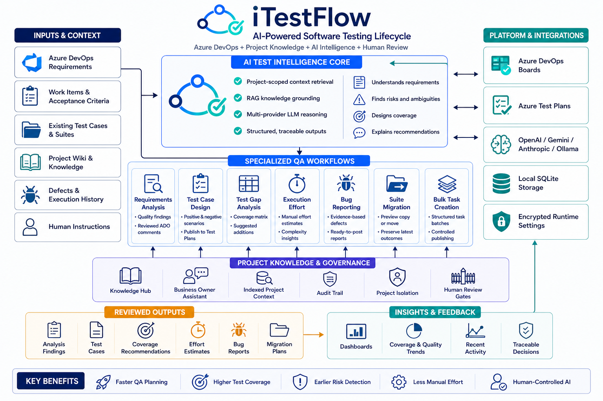

# iTestFlow

<p align="center">
  
</p>

<p align="center">
  Local-first test intelligence for Azure DevOps, grounded in project knowledge and controlled by human review.
</p>

iTestFlow brings requirement analysis, test design, coverage review, execution planning, defect reporting, and test-suite operations into one project-scoped QA workspace. It connects to real Azure DevOps and LLM provider APIs while keeping runtime settings, indexed context, audit history, and workflow records on the local machine.

## Contents

- [Architecture](#architecture)
- [Capabilities](#capabilities)
- [Quick Start](#quick-start)
- [App Links](#app-links)
- [Configuration](#configuration)
- [First-Run Workflow](#first-run-workflow)
- [Local Data and Security](#local-data-and-security)
- [Development](#development)
- [Project Documentation](#project-documentation)

## Architecture

<p align="center">
  
</p>

The browser communicates only with local Next.js API routes. Server-side domain modules own workflow logic, local SQLite access, Azure DevOps calls, and LLM provider calls.

For module boundaries and the living source map, see [PROJECT_ARCHITECTURE.md](PROJECT_ARCHITECTURE.md).

## Capabilities

### Knowledge and Context

- **Knowledge Hub** indexes filtered Azure DevOps work items, builds compiled project knowledge, monitors knowledge health, and exports a Markdown wiki.
- **Business Owner Assistant** answers questions using retrieved project context and saved knowledge, with source citations.
- **Automatic context selection** grounds supported AI workflows in relevant project information.
- **Scheduled context updates** can refresh a configured project scope using a cron expression.

### Testing Lifecycle

- **Requirements Analysis** finds ambiguities, risks, omissions, and testability concerns, then publishes reviewed comments to Azure DevOps.
- **Test Case Design** generates editable positive, negative, boundary, and edge-case scenarios and publishes approved cases to Azure Test Plans.
- **Test Gap Analysis** maps requirement details and acceptance criteria to linked test cases, identifies missing coverage, and creates selected additions.
- **Test Execution Effort** estimates manual execution time, assumptions, complexity, risks, and recommendations for linked test cases.
- **Report Bug** converts QA notes into reviewed Azure DevOps Bug work items with fields, relationships, and attachments.

### Utilities and Governance

- **Suite Migration** previews and runs same-project Test Suite copy or move operations while preserving the latest matching test-point outcomes.
- **Bulk Task Creation** defines multiple Azure DevOps Tasks once and creates each task under every selected User Story.
- **Dashboards** summarize project-scoped workflow activity, coverage, publishing, context, and LLM usage.
- **Activity Log** provides a traceable history of generated outputs, publishing operations, and user actions.
- **Human review gates** keep AI-generated analysis and artifacts editable before any Azure DevOps write.
- **Project isolation** validates Azure DevOps resources against the active project before project-scoped reads or writes.

## Quick Start

### Prerequisites

- Node.js 24 or newer
- npm
- An Azure DevOps organization URL, such as `https://dev.azure.com/YOUR_ORG`
- An Azure DevOps Personal Access Token with the permissions needed for work items, comments, Test Plans, Test Suites, test cases, and links
- One LLM provider: OpenAI, Gemini, Anthropic, or Ollama

### Install and Run

```bash
npm install
npm run dev -- --hostname 127.0.0.1 --port 3000
```

Open [Initial Configuration](http://127.0.0.1:3000/setup), test both connections, and save the settings. iTestFlow then opens the [Dashboards](http://127.0.0.1:3000/dashboards) workspace.

## App Links

These links work while the local development or production server is running on port `3000`.

| Area | Page | Description |
| --- | --- | --- |
| Overview | [Dashboards](http://127.0.0.1:3000/dashboards) | Project-scoped QA and DevOps analytics |
| Knowledge | [Knowledge Hub](http://127.0.0.1:3000/knowledge-hub) | Index context, compile knowledge, and review health |
| Knowledge | [Business Owner Assistant](http://127.0.0.1:3000/business-owner-assistant) | Ask grounded questions about the active project |
| Testing | [Requirements Analysis](http://127.0.0.1:3000/requirements-analysis) | Analyze a real Azure DevOps requirement |
| Testing | [Test Case Design](http://127.0.0.1:3000/test-case-design) | Generate, review, and publish test cases |
| Testing | [Test Gap Analysis](http://127.0.0.1:3000/test-gap-analysis) | Review traceability and missing coverage |
| Testing | [Test Execution Effort](http://127.0.0.1:3000/test-execution-effort) | Estimate manual QA execution effort |
| Testing | [Report Bug](http://127.0.0.1:3000/report-bug) | Generate and post Azure DevOps bugs |
| Utilities | [Suite Migration](http://127.0.0.1:3000/suite-migration) | Preview and execute Test Suite copy or move |
| Utilities | [Bulk Task Creation](http://127.0.0.1:3000/bulk-task-creation) | Create multiple tasks across selected User Stories |
| Administration | [Settings](http://127.0.0.1:3000/settings) | Manage integrations, models, context, and behavior |
| Administration | [Activity Log](http://127.0.0.1:3000/activity-log) | Review system and user activity |

## Configuration

### UI Configuration

The recommended setup path is [http://127.0.0.1:3000/setup](http://127.0.0.1:3000/setup). Configure:

- Azure DevOps organization URL and Personal Access Token
- LLM provider and model
- Provider API key or Ollama base URL
- Maximum output token cap and transient-failure retry count
- Project-context retrieval count
- Optional automatic context-update schedule and filters

Models are loaded from the selected provider's model-list API where supported. The top bar also displays the authenticated Azure DevOps profile and lets you choose the active project.

### Optional `.env.local` Bootstrap

UI-saved settings take priority. Environment variables are used as bootstrap values only when saved runtime settings do not exist.

Start from [.env.example](.env.example):

```bash
AZURE_DEVOPS_ORG_URL=https://dev.azure.com/YOUR_ORG
AZURE_DEVOPS_PAT=YOUR_AZURE_DEVOPS_PAT

DEFAULT_LLM_PROVIDER=openai
NEXT_PUBLIC_LLM_PROVIDER_LABEL=OpenAI
OPENAI_API_KEY=YOUR_OPENAI_KEY
OPENAI_MODEL=YOUR_MODEL_ID

LLM_MAX_OUTPUT_TOKEN_CAP=32000
LLM_RETRY_ATTEMPTS=1
PROJECT_CONTEXT_TOP_K=8
```

Provider-specific alternatives:

```bash
# Gemini
DEFAULT_LLM_PROVIDER=gemini
GEMINI_API_KEY=YOUR_GEMINI_KEY
GEMINI_MODEL=YOUR_MODEL_ID

# Anthropic
DEFAULT_LLM_PROVIDER=anthropic
ANTHROPIC_API_KEY=YOUR_ANTHROPIC_KEY
ANTHROPIC_MODEL=YOUR_MODEL_ID

# Local Ollama
DEFAULT_LLM_PROVIDER=ollama
OLLAMA_MODEL=YOUR_LOCAL_MODEL
OLLAMA_BASE_URL=http://localhost:11434
```

## First-Run Workflow

1. Configure and test Azure DevOps and LLM connections from `/setup`.
2. Select the active Azure DevOps project in the top bar.
3. Open `/knowledge-hub`, choose work-item filters, and index project context.
4. Build the compiled knowledge base if you want richer grounding and assistant answers.
5. Enter a real Azure DevOps work-item ID in Requirements Analysis, Test Case Design, Test Gap Analysis, or Test Execution Effort.
6. Review and edit every AI-generated result.
7. Publish only approved comments, test cases, suggested additions, bugs, or tasks.
8. Use Dashboards and Activity Log to review outcomes and trace recent actions.

## Local Data and Security

- Runtime settings are encrypted with AES-256-GCM in `data/runtime-settings.json`.
- The local encryption key is stored in `data/.runtime-settings-key`.
- Indexed context, knowledge, audit records, and workflow data are stored in `data/itestflow.sqlite`.
- Runtime data and secrets under `data/` are ignored by git.
- Azure DevOps and LLM requests are made server-side; credentials are not sent directly from browser components to external providers.
- Project-scoped Azure DevOps operations verify the real `System.TeamProject` value before reading or writing resources.

Treat the `data/` directory as sensitive local application state and do not share it.

## Development

The UI uses Next.js App Router, React, TypeScript, Tailwind CSS, shadcn/Radix primitives, Lucide icons, and Recharts.

### Verification

```bash
npm run typecheck
npm run build
```

### Production Build

```bash
npm run build
npm start -- --hostname 127.0.0.1 --port 3000
```

Open [http://127.0.0.1:3000](http://127.0.0.1:3000). The root route redirects to `/dashboards`.

Docker is not required.

## Project Documentation

- [Project Architecture](PROJECT_ARCHITECTURE.md) - routes, modules, integrations, storage, and architecture decisions
- [Knowledge Wiki and RAG Enhancement](docs/knowledge-wiki-rag-enhancement.md) - compiled knowledge and wiki design
- [Environment Variable Template](.env.example) - supported bootstrap configuration
